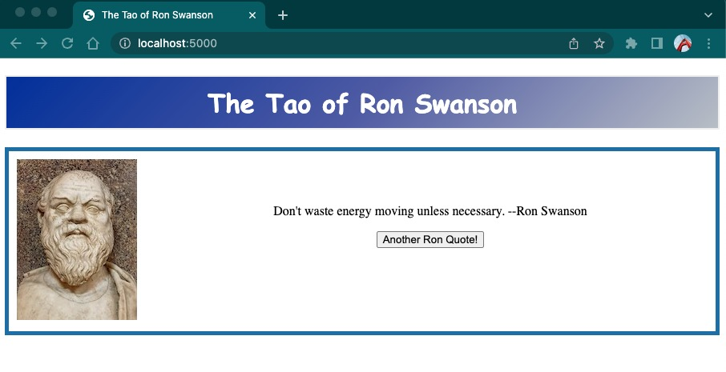

# Demo Flask App - Something Other Than the Typical 'Hello, World!' Demo

## What is this application for?

The main purpose of this application is to support the Cisco U Tutorial [Creating a Container for You Application](https://ciscolearning.github.io/cisco-learning-codelabs/posts/container-create-for-application/). This is a demo application written in Python using Flask.

The application uses an open-source API that retrieves quotes from the character Ron Swanson played by Nick Offerman on the TV series [Parks and Recreation](https://en.wikipedia.org/wiki/Parks_and_Recreation). The source code and documentation for the API server can be found at https://github.com/jamesseanwright/ron-swanson-quotes.

This application is meant for educational purposes and is meant to provide something a little more interseting than the usual 'Hello, World!' application. You are encouraged to clone this application and experiment with it. Feel free to add too it, or change it up as you see fit. Have fun with it! :stuck_out_tongue_winking_eye:

## To Utilize as a Containerized Application

Since the primary purpose of the application was meant to supplement [Creating a Container for You Application](https://ciscolearning.github.io/cisco-learning-codelabs/posts/container-create-for-application/), this application comes with a Dockerfile that can be used to build a container for this application. Below are the basic steps for containerizing the application.

1. Clone the application to the directory and go to the working directory of the cloned repository.

   ```plaintext
   $ git clone https://github.com/CiscoLearning/create-container-for-application.git
   Cloning into 'create-container-for-application'...
   remote: Enumerating objects: 52, done.
   remote: Counting objects: 100% (52/52), done.
   remote: Compressing objects: 100% (31/31), done.
   remote: Total 52 (delta 17), reused 48 (delta 15), pack-reused 0
   Receiving objects: 100% (52/52), 20.94 KiB | 5.23 MiB/s, done.
   Resolving deltas: 100% (17/17), done.
   ```

2. Move to the directory you just cloned.

   ```plaintext
   $ cd tutorial-create-container-for-application/
   ~/tutorial-create-container-for-application$
   ```

3. Run the following command and be sure that you are running this command in the root of the applications directory on the host.

   ```plaintext
   ~/tutorial-create-container-for-application$ docker build -t tao_of_ron_swanson:1.0 .
   ```

   Example Output:

   ```plaintext
   ~/create-container-for-application$ docker build -t tao_of_ron_swanson:1.0 .
   [+] Building 9.1s (9/9) FINISHED
    => [internal] load build definition from Dockerfile                                                                                                                 0.0s
    => => transferring dockerfile: 2.82kB                                                                                                                               0.0s
    => [internal] load .dockerignore                                                                                                                                    0.0s
    => => transferring context: 95B                                                                                                                                     0.0s
    => [internal] load metadata for docker.io/library/python:3.10-slim-bullseye                                                                                         0.0s
    => [internal] load build context                                                                                                                                    0.0s
    => => transferring context: 78.90kB                                                                                                                                 0.0s
    => CACHED [1/4] FROM docker.io/library/python:3.10-slim-bullseye                                                                                                    0.0s
    => [2/4] COPY . /app                                                                                                                                                0.0s
    => [3/4] WORKDIR /app                                                                                                                                               0.0s
    => [4/4] RUN pip install -r requirements.txt                                                                                                                        8.8s
    => exporting to image                                                                                                                                               0.2s
    => => exporting layers                                                                                                                                              0.2s
    => => writing image sha256:713d63d683d153a20549599786c652ff89ae0741200c8322644b7c2d70afb90f                                                                         0.0s
    => => naming to docker.io/library/tao_of_ron_swanson:1.0
    ```

4. Once the image has been built, verify it is in the local repository.

    ```plaintext
    ~/create-container-for-application$ docker images tao_of_ron_swanson:1.0
    REPOSITORY           TAG       IMAGE ID       CREATED          SIZE
    tao_of_ron_swanson   1.0       713d63d683d1   13 minutes ago   140MB
    ```

5. Next run the container. *NOTE: By default, Flask will operate on port 5000/tcp.*

    ```plaintext
    ~/create-container-for-application$ docker run -dit -p 5000:5000 --name example_image tao_of_ron_swanson:1.0
    ccdf526fafa941db9c4e3e17ba58151ccbad6830df5e8dbfbf62f636d39c4d69
    ```

6. Access the application via browser at http://localhost:5000.

    

## Notes

This application was developed with Python 3.10. The container uses python:3.10.0-slim-bullseye. This application is intended for educational purposes and is licensed under the MIT License. Orginal development by Barry Weiss. Please send questions or suggestions to [barweiss@cisco.com](mailto:barweiss@cisco.com?subject=[Github.com]%20Demo%20Flask%20App%20Repository%20Inquiry).
